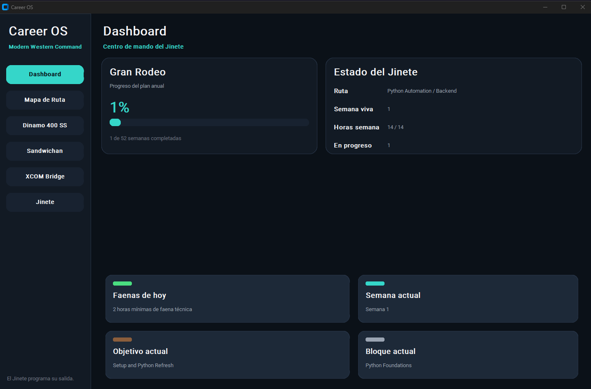

🤠 Career OS | Vaquero Moderno
Professional Mission-Control Dashboard for Systems Engineers

Career OS is a centralized command center designed to bridge the gap between technical infrastructure and business operations. Built with a Modular Object-Oriented approach, it provides a unified GUI to monitor telemetry, manage high-level roadmaps, and track business performance.

🚀 Key Modules
Mapa de Ruta (Interactive Roadmap): A 52-week persistent tracker for professional development and certification goals.

Moto Telemetry (AWS Integration): (In Progress) Real-time data visualization for the Dinamo 400 SS via AWS IoT Core.

Sandwichan Ops: Business management module for artisanal food ventures.

Aegisndr: (Planned) Security monitoring and network diagnostic toolset.

🛠️ Tech Stack
Language: Python 3.12+

GUI Framework: CustomTkinter (Modern, High-DPI support)

Data Persistence: JSON-based Local Storage (Service-oriented architecture ready for SQL migration)

Architecture: MVC-inspired Modular Design with independent Service Layers.

📂 Project Structure
Plaintext
career_os/
├── app/            # Application lifecycle and Theme definitions
├── core/           # Business logic, Services, and Data persistence
├── data/           # Local cache and seed files (GitIgnored)
└── modules/        # Domain-specific modules (Dashboard, Roadmap, Telemetry)
⚙️ Installation & Setup
Clone the repository:

Bash
git clone https://github.com/tu-usuario/career_os.git
Setup virtual environment:

Bash
python -m venv .venv
source .venv/Scripts/activate  # On Windows: .venv\Scripts\activate
Install dependencies:

Bash
pip install -r requirements.txt
Run the Command Center:

Bash
python -m app.main
Developed by Gilberto Villar - Systems Engineer & Cybersecurity Specialist.
